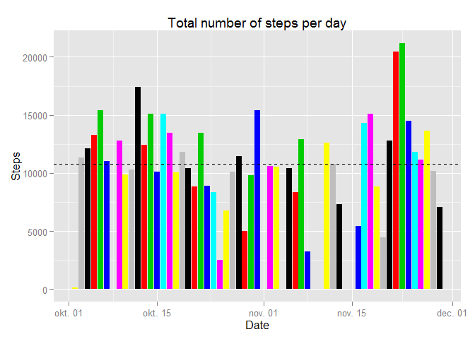
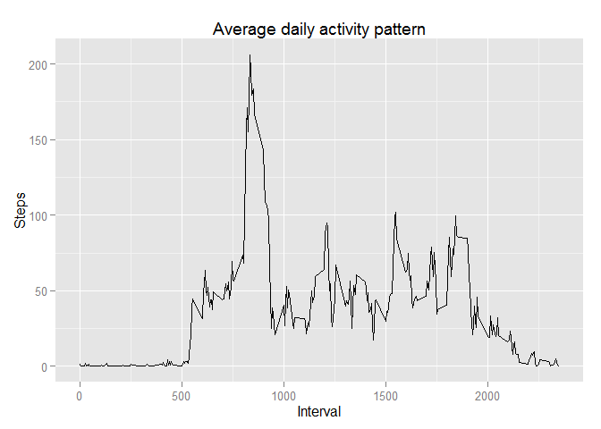
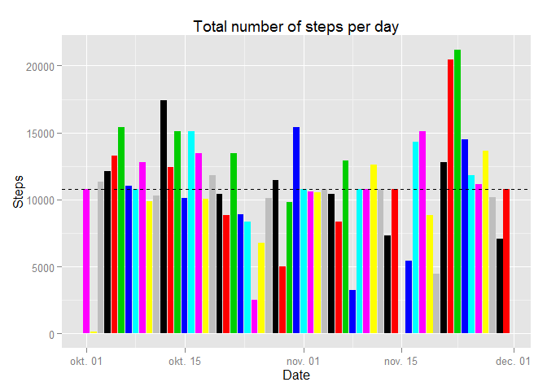
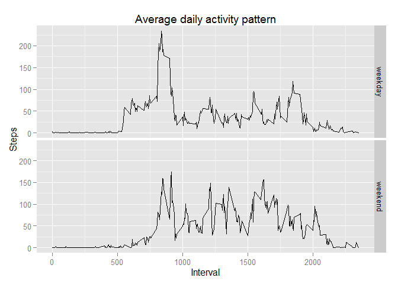

# Reproducible Research: Peer Assessment 1

Include Packages

```r
library(ggplot2)
```

```
## Warning: package 'ggplot2' was built under R version 3.1.3
```

##Loading and preprocessing the data

```r
data <- read.csv("activity.csv", header = TRUE, sep = ",")
data$date <- as.Date(data$date, format="%Y-%m-%d")
```

##What is mean total number of steps taken per day?
- The data transform 

```r
dailyStep <- aggregate(steps ~ date, data, sum, na.rm = TRUE)
```

- Histogram of the total number of steps taken each day

```r
g1 <- ggplot(dailyStep, aes(date,steps,  fill = date))
g1 <- g1 + geom_bar(stat="identity")
g1 <- g1 + labs(x = "Date", y = "Steps", title = "Total number of steps per day")
g1 <- g1 + geom_hline(aes(yintercept=mean(dailyStep$steps, na.rm = TRUE)),
                    linetype="dashed")
g1
```

 


- Report the mean and median total number of steps taken per day

```r
mean(dailyStep$steps, na.rm = TRUE)
```

```
## [1] 10766.19
```

```r
median(dailyStep$steps, na.rm=TRUE)
```

```
## [1] 10765
```

##What is the average daily activity pattern?
- The data transform 

```r
intervalSteps <- aggregate(steps ~ interval, data, mean)
```

- Time series plot of the 5-minute interval

```r
g2 <- ggplot(intervalSteps, aes(interval,steps))
g2 <- g2 + geom_line()
g2 <- g2 + labs(x = "Interval", y = "Steps", 
              title = "Average daily activity pattern")
g2
```

 

- Report the maximum number of steps

```r
intervalSteps[which.max(intervalSteps$steps),]
```

```
##     interval    steps
## 104      835 206.1698
```

##Imputing missing values

- Report the total number of missing values in the dataset

```r
sum(is.na(data$steps))
```

```
## [1] 2304
```

```r
intervalStepsMean <- aggregate(steps ~ interval, data, mean)
```

- Filling in all of the missing values in the dataset
The function replacing missing values with the mean.

```r
setNAsStepValues <- function(step, interval){
  if(is.na(step)){
    intervalStepsMean[which(intervalStepsMean$interval == interval),2]
  }else{
    step
  }
}
```


- The new dataset that is equal to the original dataset but with the missing data filled in

```r
noNaData <- data
for(i in 1:nrow(noNaData)){
  noNaData$steps[i] <- setNAsStepValues(noNaData$steps[i], 
                                        noNaData$interval[i])
}

dailyStep2 <- aggregate(steps ~ date, noNaData, sum, na.rm = TRUE)
```


- Histogram of the total number of steps taken each day, when dataset no contain missing values

```r
g3 <- ggplot(dailyStep2, aes(date,steps,  fill = date))
g3 <- g3 + geom_bar(stat="identity")
g3 <- g3 + labs(x = "Date", y = "Steps", title = "Total number of steps per day")
g3 <- g3 + geom_hline(aes(yintercept=mean(dailyStep2$steps, na.rm = TRUE)),
                    linetype="dashed")
g3
```

 

- Report the mean and median total number of steps taken per day, when dataset no contain missing values

```r
mean(dailyStep2$steps, na.rm = TRUE)
```

```
## [1] 10766.19
```

```r
median(dailyStep2$steps, na.rm=TRUE)
```

```
## [1] 10766.19
```

The original dataset mean and median are 1.0766189\times 10^{4} and 10765. 
The difference between the mean values of 0. 
The difference between the median values of -1.1886792.


##Are there differences in activity patterns between weekdays and weekends?
- New factor variable in the dataset with day of week

```r
weekData <- data
weekData$dayType <- weekdays(weekData$date)
```

The function replacing a day of the week values (weekend or weekdays). Use the Hungarian days.

```r
setDayType <- function(date){
  weekdays <- c("hétfő","kedd","szerda","csütörtök","péntek")
  if(date %in% weekdays){
    return("weekday")
  }else{
    return("weekend")
  }
}
```

- Replacing a day of the week values

```r
for(i in 1:nrow(weekData)){
  weekData$dayType[i] <- setDayType(weekData$dayType[i])
}

weekData$dayType <- as.factor(weekData$dayType);
intervalStepsWeek <- aggregate(steps ~ interval + dayType, 
                               data = weekData, mean)
```

- Panel plot containing a time series plot of the 5-minute interval and the average number of steps taken, averaged across all weekday days or weekend days 

```r
g4 <- ggplot(intervalStepsWeek, aes(interval, steps)) 
g4 <- g4 + geom_line() + facet_grid(dayType ~ .) 
g4 <- g4 + labs(x = "Interval", y = "Steps", 
              title = "Average daily activity pattern")
g4
```

 
